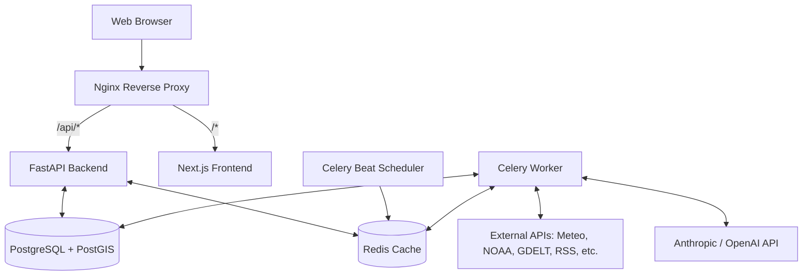

# Remembench Architecture

This document provides a comprehensive overview of the Remembench system architecture, its core components, and the data flows that power the YoY Context Engine.

---

## 1. High-Level System Overview

Remembench is built as a highly modular, decoupled full-stack application designed to scale horizontally and survive rate-limits, malformed data, and unpredictable API uptimes.

### Tech Stack
- **Frontend**: Next.js (App Router), React, Tailwind CSS, Recharts, Framer Motion.
- **Backend Application**: Python 3.11+, FastAPI, Pydantic, SQLAlchemy 2.0 (Async).
- **Background Processing**: Celery, Redis (Message Broker & Cache).
- **Database**: PostgreSQL with PostGIS extension for geospatial querying.
- **AI/LLM Layer**: Anthropic Claude (Primary), OpenAI/Gemini (Secondary fallbacks).

### Infrastructure Topology
The standard production deployment is containerized via Docker Compose. Traffic flows through an Nginx reverse proxy which routes requests to the Next.js frontend or the FastAPI backend based on the URL path.

---

## 2. Ingestion Pipeline & Data Flow

The heart of Remembench is its data ingestion engine. Instead of querying data on the fly (which is slow, expensive, and fragile), Remembench operates an asynchronous **ETL (Extract, Transform, Load)** pipeline running nightly via Celery Beat.

### 2.1 Extraction (The Adapters)
The `IngestionService` (`backend/app/services/ingestion.py`) dynamically initializes a suite of adapters. Adapters abstract the complexity of interacting with varied external sources.
All adapters conform to the `BaseAdapter` interface, which includes built-in exponential backoff via Tenacity and asynchronous HTTP request pooling.

*   **Structured Adapters**: Data is already highly normalized. (e.g., `OpenMeteoAdapter`, `HolidayAdapter`). Bypass expensive LLM processes. The `HolidayAdapter` specifically leverages the offline mathematical `python-holidays` library to generate exact regional/federal observations natively without requiring slow, unstable API connections.
*   **Unstructured Adapters**: Return raw text or noisy HTML. (e.g., `GdeltAdapter`, `WebSearchAdapter`, `IndustryRssAdapter`).

### 2.2 Transformation & Deduplication
Because Remembench ingests overlapping data (e.g., a news article from GDELT might also appear in a Google Web Search), it employs a multi-tiered deduplication strategy:

1.  **Identifier Deduplication**: Filter by unique `source` + `source_id`.
2.  **Semantic Deduplication**: Uses a local lightweight embedding model (`SentenceTransformer('all-MiniLM-L6-v2')`) to compare textual similarity across unstructured events. If two articles share 85%+ semantic similarity, one is dropped *before* hitting the expensive LLM layer.
3.  **Database Constraint (Zero-Token Deduplication)**: Fast PostgreSQL lookups to drop existing `source_ids`, followed by `ON CONFLICT DO NOTHING` on the insert statement.

### 2.3 AI Classification
Unstructured events that survive deduplication are routed to the `ClassificationService`.
To heavily optimize token costs and throughput, events are packaged into batches (configurable size, typically 10) and sent via asynchronous semaphores to the LLM. 

The LLM (Anthropic Claude by default) is mandated to reply in a strict JSON schema, which:
*   Identifies the category and subcategory.
*   Assigns a `Severity` score (0.0 to 1.0) dictating the event's business disruption magnitude.
*   Assigns a `Confidence` score (0.0 to 1.0).
*   Extracts normalized event dates.
*   **Temporal Situational Awareness:** The `IngestionService` injects the user's explicit requested dashboard window (e.g. `2025-05-01 to 2025-05-03`) into the classification batch prompt. This mathematical context ensures that if an older "ongoing coupon" is scraped, the LLM sets the date to safely remain within the dashboard view instead of blindly isolating the date to the historical article publication.
*   Filters out irrelevant noise (e.g., articles mentioning "pizza" but having no business relevance).

---

## 3. The Analytics & Dashboard Flow

When a user opens the Remembench dashboard, the system doesn't just return raw lists. It cross-references categories, severity, and timeframes to produce insights.

### 3.1 The YoY Comparison Route (`/api/v1/yoy/compare`)
This endpoint is the functional core of the UI. It accepts a date range (e.g., March 2025) and calculates the **exact comparable ranges** for prior years. 
It then queries PostgreSQL using complex aggregations (PostGIS `ST_DWithin` if radii are supplied, or string matching on semantic `geo_label`) to return events nested by year, category, and severity thresholds.

### 3.2 AI Executive Briefings
To synthesize hundreds of data points, the frontend requests an Executive Briefing (`/api/v1/events/briefing`). 
The backend extracts the highest severity events from the payload and triggers a synchronized, rapid LLM call. The LLM acts as an "Analyst," grouping the events into a narrative markdown blob summarizing the market context (e.g., *"March 2024 saw significant headwinds due to 3 major snowstorms and an aggressive Domino's BOGO promotion..."*).

---

## 4. Frontend Architecture

The Next.js application is strictly a **presentation layer**. It contains no business logic or database connections.

*   `app/page.js`: The root dashboard orchestrator. Manages high-level state (selected industry, date ranges, geography).
*   `hooks/useDashboardData.js`: Centralized data-fetching hook. Prevents prop-drilling by managing SWR-like caching, loading states, error boundaries, and parallel requests to the API.
*   `components/`: Highly modular design system using Tailwind CSS and Radix/Custom UI. Contains specialized visualization tools like `MetricCharts.js` (Recharts) and `EventFeed.js` (Framer Motion lists).

### State Management
State is managed hierarchically via React Context and Hooks. The UI remains fully pessimistic while loading (displaying skeleton loaders) and caches responses client-side to make toggling between years feel instantaneous.

---

## 5. Scaling Strategies

Remembench is engineered for straightforward horizontal and vertical scaling:

1.  **Horizontal Celery Architecture**: If backfilling years of historical GDELT data, operators can seamlessly scale up multiple `celery-worker` Docker containers. The Redis message broker distributes tasks across all available workers.
2.  **In-Memory API Caching**: Heavy endpoints (`/stats/summary`, `/yoy/compare`) are wrapped in custom Redis idempotency locks. Identical requests from disparate users hit Redis memory rather than hammering Postgres or the LLM.
3.  **Partial Indexing**: Postgres relies on optimized partial indexes tailored precisely for Remembench queries (e.g., `CREATE INDEX ON impact_events (industry) WHERE source_id IS NOT NULL;`).

---

## 6. Directory Structure Blueprint

*   **`backend/app/adapters/`**: Fetchers. Where API integration code lives.
*   **`backend/app/services/`**: Business Logic. Deduplication, LLM batching, orchestration.
*   **`backend/app/routes/`**: FastAPI endpoints parsing HTTP requests to service calls.
*   **`backend/app/industries.py`**: The "Registry". The only file you need to modify to launch a new vertical.
*   **`backend/app/models.py`**: SQLAlchemy ORM declarations. 
*   **`frontend/app/components/`**: React visual hierarchy.
